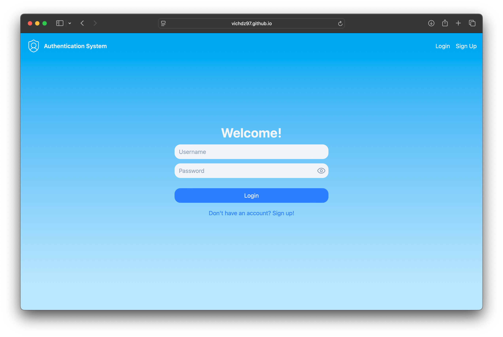
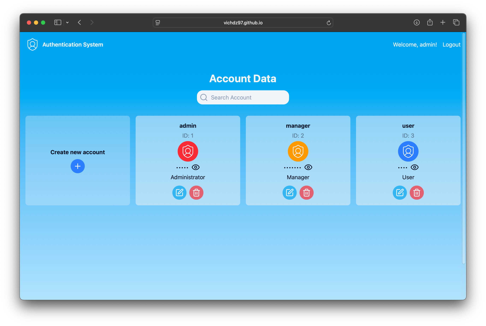
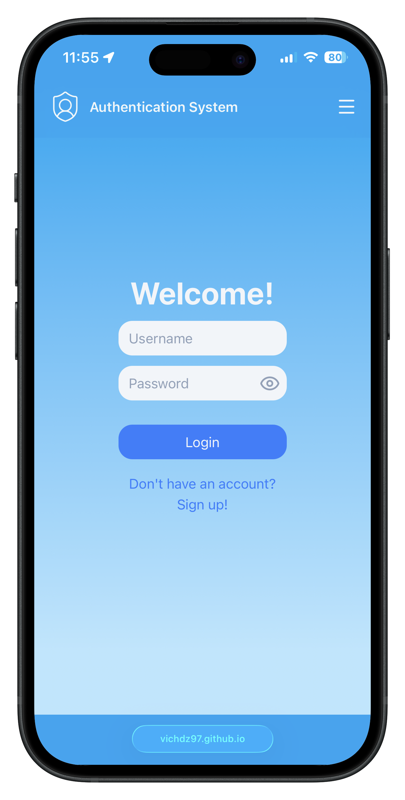
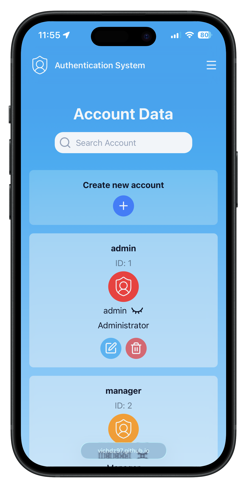

# Authentication System
> [!NOTE]
> Last updated January 14, 2026

## Summary
This authentication system prompts the user for their login credentials (username and password) and redirects them to the appropriate landing page depending on their role: a user, a manager, or an administrator. Once redirected, the user is able to view, modify, or delete their information. If the user cannot provide their login credentials—in other words, the user does not have an account—then they can sign up and create an account.

## Demo
Access the live demo [here](https://vichdz97.github.io/projects/authentication-system/).

## Technologies
- [Angular](https://angular.io) (*v20.3.2*)
- [Firebase](https://firebase.google.com) (*current*)
- [Firebase CLI](https://firebase.google.com/docs/cli) (*v15.3.0*)
- [JSON Server](https://my-json-server.typicode.com) (*v1 beta*)
- [Lucide Icons](https://lucide.dev/) (*v0.562.0*)
- [Postman](https://www.postman.com/) (*v11.80.2*)
- [Postman Agent](https://www.postman.com/downloads/postman-agent/) (*v0.4.83*)
- [Tailwind CSS](https://tailwindcss.com/) (*v4.1.13*)

## Screenshots
### Desktop View
 

### Mobile View
 